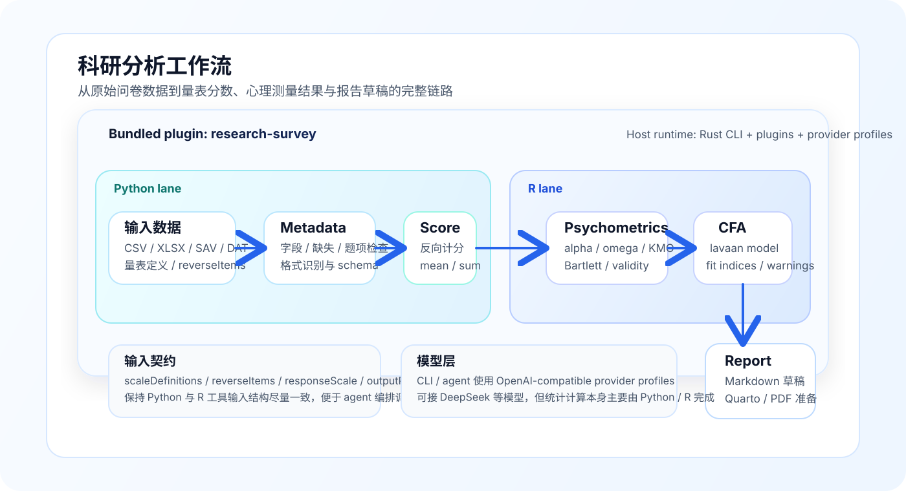

# claw-code-paper

<p align="center">
  
</p>

一个 **Rust-first 的科研数据分析智能体 CLI**。

当前项目重点不是做通用代码助手，而是把 Claw/Claude Code 风格的 agent runtime，改造成更适合**问卷研究、量表分析、科研数据处理与分析报告生成**的工作台。

当前优先方向：
- 问卷 / 量表数据处理
- 反向计分、均分/总分生成
- 信度 / 效度预检查
- CFA（验证性因子分析）
- 分析结果整理与 Markdown 报告草稿生成
- 支持 **DeepSeek / OpenAI-compatible** 等可替换模型后端
- **CLI 先行，GUI 后续再加**

---

## 当前项目定位

这个仓库现在的目标可以概括成一句话：

> 把一个通用 agent CLI 内核，改造成一个专门面向科研数据分析的智能体。

它的策略不是重度 fork 内核然后一路深改，而是尽量：

- 用 Rust 保持核心运行时稳定
- 减少与上游内核演进的强耦合
- 把差异化能力集中在：
  - research 配置
  - prompts / skills
  - bundled plugins
  - Python + R 分析桥接

这也是为什么目前我们最重要的领域能力，是 `research-survey` 这个内置插件，而不是去重写整套 runtime。

---

## 当前已经具备的科研能力

当前仓库已经具备一条比较清晰的科研分析链路：

1. **数据读取与元数据检查**
   - CSV
   - Excel / `.xlsx`
   - SPSS `.sav`
   - `.dat`

2. **量表计分（Python）**
   - 反向题处理
   - 均分 / 总分
   - `minValidItems` 控制
   - 可导出打分后数据集

3. **心理测量 / 统计分析（R）**
   - Cronbach's alpha
   - McDonald's omega
   - KMO
   - Bartlett
   - 可选 CFA（lavaan）

4. **分析报告生成**
   - Markdown 报告草稿
   - 为后续 Quarto / PDF / Word 输出做准备

当前最核心的领域插件文档在这里：

- [`rust/crates/plugins/bundled/research-survey/README.md`](rust/crates/plugins/bundled/research-survey/README.md)

---


## 科研分析工作流图

<p align="center">
  
</p>

这张图对应当前主推链路：

```text
原始数据 -> survey_metadata -> survey_score -> survey_psychometrics -> survey_report
```

其中：
- 前半段主要由 **Python** 负责数据读取、字段检查、反向计分与量表分数生成
- 后半段主要由 **R** 负责 psychometrics 与 CFA
- Rust CLI/runtime 负责统一编排、provider 配置、plugin 调用与 agent 入口

## 技术架构

### 1. Rust-first CLI 内核

当前主开发面已经切到 Rust workspace：

- `rust/`：当前主 CLI / runtime / plugins 工作区

其中主要 crate 包括：
- `claw-cli`：CLI 入口
- `runtime`：运行时与配置加载
- `plugins`：插件管理
- `api`：模型提供方与 API 客户端
- `tools` / `commands`：工具与命令编排
- `server` / `lsp`：新增的服务与语言支持相关能力

### 2. Python + R 双后端分析层

科研分析能力目前采取双后端：

- **Python**：数据读取、清洗、metadata、scoring、中间产物导出
- **R**：psych / lavaan 这一类更贴近科研统计工作流的分析

这样做的原因很直接：
- Python 更适合工程集成和数据预处理
- R 更适合心理测量与统计分析

### 3. 可替换模型提供方

当前不是只能用 Claude。

项目已经支持 **OpenAI-compatible provider profiles**，因此可以接：
- DeepSeek
- 其他 OpenAI-compatible 网关 / 模型服务

也就是说，模型层是可替换的，科研能力不应绑定在某一家模型厂商上。

---

## 仓库结构

```text
.
├── rust/                                   # 当前主开发面（Rust workspace）
│   ├── Cargo.toml
│   ├── crates/
│   │   ├── claw-cli/
│   │   ├── runtime/
│   │   ├── plugins/
│   │   ├── api/
│   │   ├── tools/
│   │   ├── commands/
│   │   ├── lsp/
│   │   └── server/
│   └── docs/
├── rust/crates/plugins/bundled/research-survey/   # 当前最重要的科研分析插件
├── src/                                    # 早期 Python 面，现为历史/兼容参考面
├── tests/                                  # Python 侧验证面
├── CLAW.md                                 # 仓库内指令与工作约定
└── README.md
```

说明：
- **现在的主线开发以 `rust/` 为主**
- `src/` / `tests/` 仍保留，用于历史兼容、参考与部分验证面
- 科研能力当前主要集中在 `rust/crates/plugins/bundled/research-survey/`

---

## 快速开始

### 1. 构建 CLI

如果你的 `cargo` 在 PATH 里：

```bash
cd rust
cargo build -p claw-cli
```

如果你的环境和我这边一样，需要显式路径：

```bash
cd rust
~/.cargo/bin/cargo build -p claw-cli
```

### 2. 查看帮助

```bash
./target/debug/claw --help
```

### 3. 查看 agents / skills

```bash
./target/debug/claw agents
./target/debug/claw skills
```

### 4. 进入交互式 CLI

```bash
./target/debug/claw
```

---

## 配置科研分析模式

推荐在项目根目录放一个本地配置文件：

- `.claw/settings.local.json`

示例：

```json
{
  "model": "deepseek-chat",
  "providers": {
    "default": "deepseek",
    "profiles": {
      "deepseek": {
        "type": "openai-compat",
        "providerName": "DeepSeek",
        "apiKeyEnv": "DEEPSEEK_API_KEY",
        "baseUrl": "https://api.deepseek.com/v1",
        "defaultModel": "deepseek-chat"
      }
    }
  },
  "research": {
    "enabled": true,
    "profile": "survey",
    "artifactDir": ".claw/artifacts"
  },
  "plugins": {
    "enabled": {
      "research-survey@bundled": true
    }
  }
}
```

然后在 shell 里配置 key：

```bash
export DEEPSEEK_API_KEY=your_key_here
```

再启动：

```bash
cd rust
./target/debug/claw
```

---

## 当前科研插件：research-survey

这是目前最关键的一层能力封装。

### 已有工具

- `survey_metadata`
  - 数据结构、缺失率、字段、题项覆盖检查
- `survey_score`
  - 反向计分、均分/总分生成、导出打分后数据
- `survey_psychometrics`
  - 信度、效度预检查、可选 CFA
- `survey_report`
  - Markdown 报告草稿输出

### 推荐工作流

```text
survey_metadata
  -> survey_score
  -> survey_psychometrics
  -> survey_report
```

详细说明请看：
- [`rust/crates/plugins/bundled/research-survey/README.md`](rust/crates/plugins/bundled/research-survey/README.md)

---

## 本地直接体验科研能力

即使暂时不接模型，也可以先直接体验插件工具。

例如运行量表计分：

```bash
printf '%s' '{
  "datasetPath": "rust/crates/plugins/bundled/research-survey/fixtures/mini_survey.csv",
  "scaleDefinitions": [{
    "name": "engagement",
    "items": ["q1", "q2", "q3", "q4"],
    "reverseItems": ["q3"],
    "outputColumn": "engagement_mean",
    "method": "mean",
    "minValidItems": 3
  }],
  "reverseItems": ["q3"],
  "responseScale": {"min": 1, "max": 5},
  "idColumns": ["id"]
}' | \
env CLAW_TOOL_NAME=survey_score \
    CLAW_PLUGIN_ID=research-survey@bundled \
    CLAW_PLUGIN_ROOT=$(pwd)/rust/crates/plugins/bundled/research-survey \
    CLAW_WORKSPACE_ROOT=$(pwd) \
    python3 rust/crates/plugins/bundled/research-survey/tools/survey_tools.py
```

---

## 验证命令

Rust 工作区验证：

```bash
cd rust
cargo fmt --all --check
cargo test --workspace
cargo clippy --workspace --all-targets -- -D warnings
```

插件侧最小验证：

```bash
python3 -m py_compile rust/crates/plugins/bundled/research-survey/tools/survey_tools.py
python3 -m json.tool rust/crates/plugins/bundled/research-survey/.claw-plugin/plugin.json >/dev/null
```

---

## 当前状态

当前项目已经完成这些关键转向：

- 采用 **Rust 内核** 作为主开发线
- 将科研差异化能力集中到插件 / prompts / bridge 层
- 接入 **OpenAI-compatible** provider profile 机制
- 增加问卷分析插件 `research-survey`
- 已具备 questionnaire scoring + psychometrics + report 的基础闭环

这意味着项目已经不再只是一个“源码改写实验”，而是在逐步变成一个真正可用的**科研数据分析 agent CLI**。

---

## Roadmap

下一阶段优先方向：

1. 更完整的量表 scoring 模板库
2. EFA / 因子提取与旋转
3. 分组差异检验、回归、中介/调节分析
4. 自动生成结果表格（如 APA 风格）
5. Quarto / PDF / Word 输出
6. CLI 稳定后补充 GUI

---

## Built with oh-my-codex

这个项目的规划、迁移、验证与多轮重构工作，持续使用了 [oh-my-codex (OMX)](https://github.com/Yeachan-Heo/oh-my-codex) 的多智能体工作流能力来推进。

在当前仓库中，OMX 主要被用于：
- 规划与持续执行
- 代码迁移与核对
- 文档重构
- 验证与收敛

---

## Disclaimer

- 本仓库不是原始 Claw Code 官方仓库。
- 本仓库当前方向是基于现有 agent/runtime 思路，发展出**科研数据分析专用工作流**。
- 统计结果应由研究者人工复核，不应直接视为最终发表结论。
